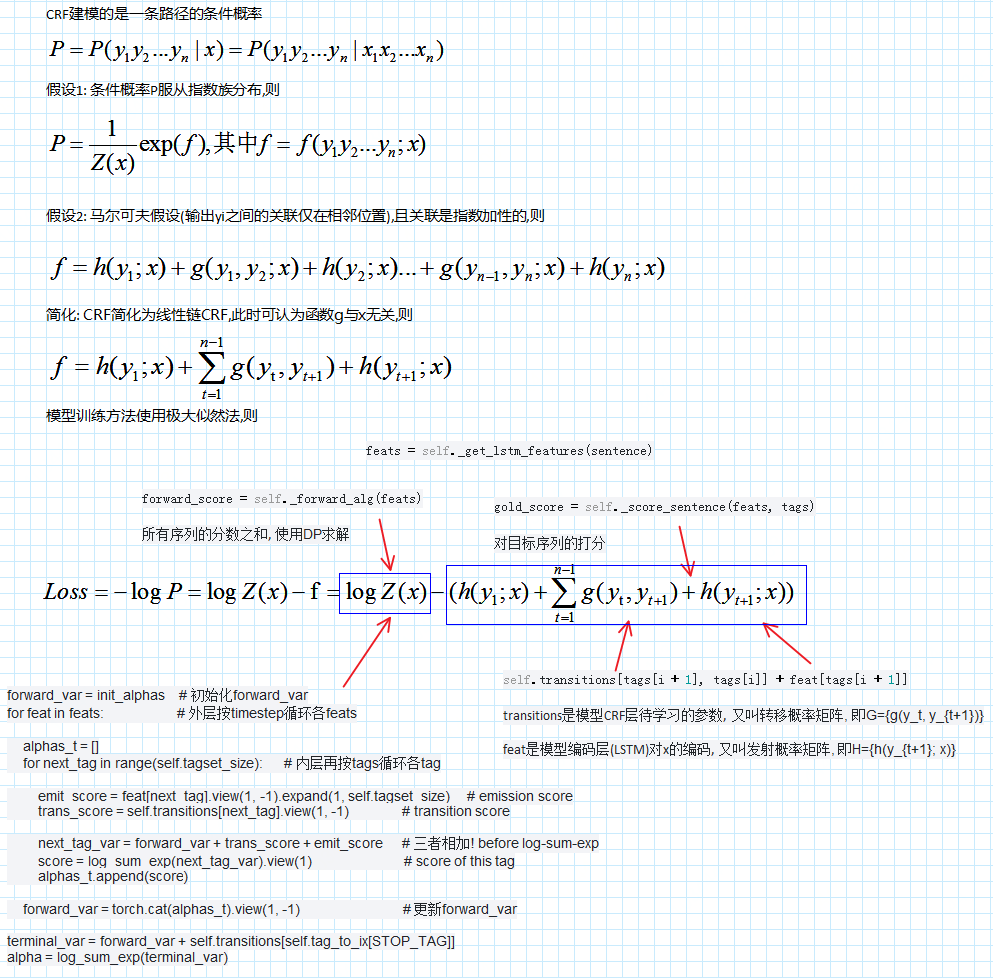

# 4. Probabilistic Graphical Models (PGM)

## 4.1 Overview

Hidden Markov Model, Bayesian Network, Conditional Random Field, Maximum Entropy Markov Model, Latent Dirichlet Allocation, LSI

Course: <https://www.coursera.org/specializations/probabilistic-graphical-models>

### Article

- [李宏毅机器学习2016 第四讲 分类：概率生成模型 - 2019](https://zhuanlan.zhihu.com/p/32949973)

- [概率图模型（PGM）有必要系统地学习一下吗？ - 2015](https://www.zhihu.com/question/23255632/answer/56330768)

- [概率图模型体系：HMM、MEMM、CRF - 2018](https://zhuanlan.zhihu.com/p/33397147)

    **YAO**: OK  内容吸引进了5.3、5.4、5.5章节里，另外有特征函数实例可供参考。

- [非常详细的有向图模型与无向图模型原理总结 - 2019](https://mp.weixin.qq.com/s?__biz=MzU0MDQ1NjAzNg==&mid=2247488315&idx=1&sn=e32ff686e3f2d0f8b6d42ef62a53f769)


### Book

- [Handbook of Graphical Models](https://stat.ethz.ch/~maathuis/papers/Handbook.pdf)


## 4.2 Bayesian 

## 4.2.1 Bayesian Network (BN)

### Article

- [从贝叶斯方法谈到贝叶斯网络 - 2014](https://blog.csdn.net/v_july_v/article/details/40984699)

- [贝叶斯网络，看完这篇我终于理解了(附代码)！ - 2019](https://zhuanlan.zhihu.com/p/73415944)


## 4.2.2 Bayesian Deep Learning

### Practice

- [用Keras和Tensorflow构建贝叶斯深度学习分类器 - 2019](https://mp.weixin.qq.com/s?__biz=MzU4MjQ3MDkwNA==&mid=2247490390&idx=1&sn=46b59cef0141a3da2edb6e6115e2c9bd)

    **Reference**: [Building a Bayesian deep learning classifier - 2017](https://towardsdatascience.com/building-a-bayesian-deep-learning-classifier-ece1845bc09)


## 4.3 Hidden Markov Model (HMM)

#### Concept

Y1 --> Y2 --> Y3 --> ... --> Yn
|      |      |              |
X1     X2     X3             Xn

$Y_i \rightarrow Y_{i+1}$

$Y_i \rightarrow X_i$

HMM是**生成式**模型，属于贝叶斯派，对**联合概率分布**$P(Y, X)$进行建模，在模型的基础上进行推断，得到$P(Y|X)$

假设序列长度为N，$X_t$为t处的观察值，$Y_t$为t处的真实值，计算联合概率分布$P(Y, X)$：

$$P(Y, X) = P(X|Y) * P(Y) = P(X_1X_2...X_N|Y_1Y_2...Y_N) * P(Y_1Y_2...Y_N)$$

HMM有2个基本假设：

- **观测值独立假设：$X_t$只与$Y_t$有关**

- **一阶马尔可夫假设：$Y_t$只与$Y_{t-1}$有关** (无后效性，是Viberbi算法使用的DP思想所需要的)

则有：

$$P(Y, X) = ∏P(X_i|Y_i) ∏P(Y_t|Y_{t-1})$$

其中，分子第1项使用了观测值独立假设，分子第2项使用了一阶马尔可夫假设。

BTW，马尔可夫模型只关注Y，而HMM中的所谓Hidden，是指无法直接观测到Y，它被Hidden了，只能观测到它的观测值X，用X来表征Y，来反推Y，HMM关注真实值Y和观测值X。

#### Learning

即：**$P(X_i|Y_i)$, $P(Y_t|Y_{t-1})$, $P(Y_0)$ --> $P(Y, X)$**

$P(X_i|Y_i)$称为生成概率，$P(Y_t|Y_{t-1})$称为转移概率，以及$P(Y_0)$称为初始概率，这些概率都是HMM的参数，Learning就是计算或估计这些概率。主要有2类训练方法：

- 有监督训练：$P(X_i|Y_i)$和$P(Y_0)$可由人工标注而计算，$P(Y_t|Y_{t-1})$是基于语料库依照统计语言模型的训练方法来计算，使用**极大似然估计**

- 无监督训练：仅仅通过大量的观测值$X_i$就能推算这3类概率，使用的训练算法主要是**Baum-Welch算法**

Baum-Welch算法：本质上是EM算法，初始化一套初始值，然后迭代计算，根据结果再调整值，再迭代，最后收敛

#### Inference

即：**$Y=argmax(P(Y'|X))=argmax(P(Y',X)/P(X)$**

给定一个模型和某个特定的观测序列X，找出最可能产生这个观测序列的状态序列Y。由于$P(X)$是一个常数，则$P(Y'|X)$的大小取决于$P(Y', X)$。使用的解码算法是**Viterbi算法**

Viterbi算法：本质上是DP(Dynamic Programming)算法

#### Evaluating

即：**$P(X|\lambda)$**

序列标注问题中只有一个HMM时，不需要计算序列概率；而序列分类问题中会有多个HMM，要计算序列概率，从而判断序列属于哪个类别（类别与各HMM一一对应）。一般有3种方法：

直接计算法：穷举搜索

前向算法和后向算法：本质上是DP算法

### Article

- [隐马尔科夫模型python实现简单拼音输入法 - 2016](https://www.cnblogs.com/lrysjtu/p/5343254.html)

- [隐马尔可夫模型（HMM）的numpy实现 - 2019](https://zhuanlan.zhihu.com/p/75406198)

    **YAO**: 待以后细细研究


## 4.4 Maximum Entrop Markov Model (MEMM)

Y1 --> Y2 --> Y3 --> ... --> Yn
|      |      |              |
X1     X2     X3             Xn

$Y_i \rightarrow Y_{i+1}$

$Y_i \leftarrow X_i$  (注意，与HMM箭头方向相反！)

MEMM，即最大熵马尔可夫模型，是**判别式**模型，不同于HMM是在确定联合分布，判别式模型直接是确定**边界**。

HMM中，$X_i$只依赖$Y_i$，而在MEMM中，$Y_i$依赖$X_i$和$Y_{i-1}$

以序列标注POS为例：

句子是X，对X的某个标注序列为Y，$f_j$是事先定义的特征函数$\lambda_j$是该特征函数的权重，则$score(Y|X)$为给定句子X情况下标注序列Y的评分：

$$score(Y|X) = \sum_{j=1}^C\lambda_jf_j(X, Y)$$

其他标注序列Y'的评分为$score(Y'|X)$，对这些分数进行指数化和标准化，可得到标注序列Y的概率$P(Y|X)$，与CRF不同，在$P(Y|X)$公式中，归一化在指数内部，叫做Local归一化，导致MEMM的Viterbi转移过程中无法正确地递归到全局最优，容易陷入局部最优。

#### Learning

即：**$\lambda_j --> score(Y|X) --> P(Y|X)$**

由于MEMM是学习边界，用函数直接判别，其学习方法有极大似然估计、梯度下降、牛顿迭代、拟牛顿下降、BFGS、L-BFGS等各种优化方法。

#### Inference

即：**$Y=argmax(P(Y'|X))$**

类似于HMM，使用Viterbi算法

#### Evaluating

同HMM

#### Labeling Bias

MEMM讨论最多的是标注偏置问题，……，MEMM倾向于选择拥有更少转移的状态


## 4.5 Conditional Random Field (CRF)

#### Concept

注意，以下说法是纯粹对CRF的描述，若想直接了解RNN+CRF，可能略有不同，建议直接参考下面的Code部分

Y1 --- Y2 --- Y3 --- ... --- Yn
| /  \ | /  \ | /          \ |
X1     X2     X3             Xn

注意：Y之间，Y与X之间无方向

HMM是**生成式**模型，是在**拟合联合概率分布$P(Y,X)$**，而CRF是**判别式**模型，直接**拟合条件概率$(Y|X)$**

以序列标注POS为例：

句子是X，对X的某个标注序列为Y，$f_j$是事先定义的特征函数（共有C个），$\lambda_j$是该特征函数的权重，则$score(Y|X)$为给定句子X情况下标注序列Y的评分：

$$score(Y|X) = \sum_{j=1}^C\sum_{i=1}^N\lambda_jf_j(X, i, Y_i, Y_{i-1})$$


含义是**每种特征都应用于X，每种特征都是一种限定作用，每个$X_i$都会产生C个特征**，满足特定限定条件取值为1否则为0（有时也可为负值，表示一种惩罚）。这些特征取值加权求和就是score。又可把score拆分为2部分，分别对应着2类特征函数：转移特征（共有K个）和状态特征（共有L个，K+L=C）

$$score(Y|X) = \sum_{k=1}^K\sum_{i=1}^N\lambda_kf_k(X, i, Y_i, Y_{i-1}) + \sum_{l=1}^L\sum_{i=1}^N\lambda_lf_l(X, i, Y_i, Y_{i-1})$$

**转移特征针对的是前后$X_i$之间的限定，状态特征针对的$X_i$与$Y_i$之间的限定**，不过一般情况下两者不必区分。

其他标注序列Y'的评分为$score(Y'|X)$，对这些分数进行指数化和标准化(Softmax转换)，可得到标注序列Y的概率$P(Y|X)$，如下所示：

$$P(Y|X)=softmax(score(Y|X))$$


另外，由特征函数$f_j(X, i, Y_i, Y_{i-1})$可看出：

- **CRF没有观测值独立假设**：$i$与整个$X$相关（而非$X_i$, $X_{i-1}$之类的），表现在函数中的(X, i)

- **CRF有马尔可夫假设**：$i$只与$Y_i$和$Y_{i-1}$相关，表现在函数中的(i, Y_i, Y_{i-1})

HMM VS CRF：两者都有**马尔可夫假设(状态$Y_i$只与$Y_{i-1}$相关)**，前者还有观测值独立假设，后者不需要这个假设。

#### Learning

即：**$\lambda_j --> score(Y|X) --> P(Y|X)$**

特征函数是事先定义好的（**TODO: 如何定义，怎么定义？**），参数求解过程同MEMM，使用极大似然估计、梯度下降、牛顿迭代、拟牛顿下降、BFGS、L-BFGS等。

#### Inference

即：**$Y=argmax(P(Y'|X))$**

类似HMM，使用Viterbi算法

#### Evaluating

同HMM

### Code

- <https://github.com/keras-team/keras-contrib/blob/master/keras_contrib/layers/crf.py> (Keras)

    Keras_contrib中的CRF，详情请参考：[Keras Others](https://github.com/liuyaox/coding_awesome/blob/master/Keras/05-Keras_Others.md)

    - [CRF Accuracy](https://github.com/keras-team/keras-contrib/blob/master/keras_contrib/metrics/crf_accuracies.py)

    y_true和y_pred在每个sample的每一桢timestep上都进行对比，以计算平均准确率

    ```python
    # y: <n_samples, n_timesteps, n_labels>   sparse_target=False
    accuracy = K.mean(K.equal(K.argmax(y_true, -1), K.argmax(y_pred, -1)))
    # y: <n_samples, n_timesteps, 1>   sparse_target=True
    accuracy = K.mean(K.equal(y_true[:, :, 0], y_pred[:, :, 0]))
    ```

    - [CRF Loss](https://github.com/keras-team/keras-contrib/blob/master/keras_contrib/losses/crf_losses.py)

    **TODO**: 详细定义是啥？需要仔细研究！参考下面2个项目

- 【Great】[简明条件随机场CRF介绍（附带纯Keras实现）- 2018](https://zhuanlan.zhihu.com/p/37163081)

    **YAO**: 代码建议参考下面的'PyTorch官方实现的CRF'，两者配合着看，效果更好！

    CRF在模型输出端**显式地考虑输出之间的关联**，另外它是以路径为单位，考虑的是路径的概率。而非CRF时，意味着将这种关联放在了模型的编码层面，希望模型能自己学到这些关联，有时会“强模型所难”

    Softmax VS CRF : 前者把序列标注看成是**n个k分类**问题，关注的分别是n个点，各点之间无前后关联；后者将序列标注看成是**1个k^n分类**问题，它关注的是n个点及其前后关联，即一条路径(n个点，共有k^n种路径)

    CRF的Loss包括2部分：归一化因子logZ(x)-目标序列的得分f，两者共同需要的是**Transition概率矩阵G和Emission概率矩阵H，其中G是模型CRF层待学习的参数，H是模型RNN层的编码输出**，这一点是关键，需要重点理解！

    - logZ(x): 一条路径得分的状态转移方程是$Z_{t+1}^i=(Z_t^1G_{1i}+Z_t^2G_{2i}+...+Z_t^kG_{ki})H_{t+1}(i|x)$，可知共有3部分组成：$Z_t$表示上一步状态，$G_{.i}$表示转移概率，$H_{t+1}$表示发射概率，使用动态规划可算出所有路径得分之和，详见下面NOTE

    - 目标序列得分f: 由各timestep的小积分相加而得，小积分包括2部分，Transition概率$g(y_k,y_{k+1})$和Emission概率$h(y_{k+1};x)$，分别来自于G和H

    解码应用：使用动态规划Viterbi算法

- 【Great】<https://pytorch.org/tutorials/beginner/nlp/advanced_tutorial.html> (PyTorch)

    PyTorch官方实现的CRF

    **Github**: <https://github.com/pytorch/tutorials/blob/master/beginner_source/nlp/advanced_tutorial.py>

**NOTE**: 综合以上2个项目，得出LSTM+CRF中的CRF的Loss和forward




### Article

- [Introduction to Conditional Random Fields - 2012](http://blog.echen.me/2012/01/03/introduction-to-conditional-random-fields/)

    **Chinese**: [如何轻松愉快地理解条件随机场（CRF）？](https://www.jianshu.com/p/55755fc649b1)

    **YAO**: OK  Point: CRF退化为HMM
    
    **HMM是NB的序列化版本，Linear-chain CRF是LR的序列化版本，LR是NB的条件化版本，Linear-chain CRF是HMM的条件化版本**

    **CRF VS HMM** : CRF可以解决所有HMM能解决的问题，CRF可形式化地退化为HMM（每个HMM模型都等价于某个CRF）：
    
    - 按照CRF的$score(Y|X)$的形式，为HMM中每个转移概率$P(Y_i=a|Y_{i-1}=b)$定义一个权重是$logP(Y_i=a|Y_{i-1}=b)$的特征函数：

        $$f_1(X, i, Y_i, Y_{i-1}) = 1 当且仅当Y_i=a且Y_{i-1}=b否则为0$$

    - 与上面类似，为HMM中每个发射概率$P(X_i=c|Y_i=d)$定义一个权重是$logP(X_i=c|Y_i=d)$的特征函数：

        $$f_2(X, i, Y_i, Y_{i-1}) = 1 当且仅当X_i=c且Y_i=d否则为0$$

    - 此时把$f_1$和$f_2$代入CRF的$score(Y|X)$中，其形式与HMM的对数联合概率$logP(Y, X)$几乎是一样的：

        $$logP(Y, X) = \sum(logP(X_i|Y_i)) + \sum(logP(Y_i|Y_{i-1}))$$

    - 结论：HMM具有天然局限性，当前单词$X_i$只依赖于当前标签$Y_i$，当前标签$Y_i$只依赖于前一个标签$Y_{i-1}$，这限制了HMM只能定义相应类型的特征函数，而CRF却可以着眼于整个句子X定义更加全局性的特征函数，比如"$Y_1$是动词，$X_n$是问号时，特征函数取1，否则取0"，同时各特征函数可使用任意的权重。

- [如何用简单易懂的例子解释条件随机场（CRF）模型？它和HMM有什么区别？](https://www.zhihu.com/question/35866596)

- [条件随机场CRF(一) 从随机场到线性链条件随机场 - 2017](https://www.cnblogs.com/pinard/p/7048333.html)

- [条件随机场CRF(二) 前向后向算法评估标记序列概率 - 2017](https://www.cnblogs.com/pinard/p/7055072.html)

- [条件随机场CRF(三) 模型学习与维特比算法解码 - 2017](https://www.cnblogs.com/pinard/p/7068574.html)


## 4.6 MEM, and Others

MEM: Maximum Entropy Model


## 4.7 Expectation-Maximization (EM)

#### Article

- [怎么通俗易懂地解释EM算法并且举个例子 - 2015](https://www.zhihu.com/question/27976634)

- [从最大似然到EM算法浅解 - 2013](https://blog.csdn.net/zouxy09/article/details/8537620)

- [一文详尽系列之EM算法 - 2019](https://mp.weixin.qq.com/s?__biz=MjM5ODkzMzMwMQ==&mid=2650411867&idx=3&sn=5522d62b74a3ed6fb77b0e715e55c214)